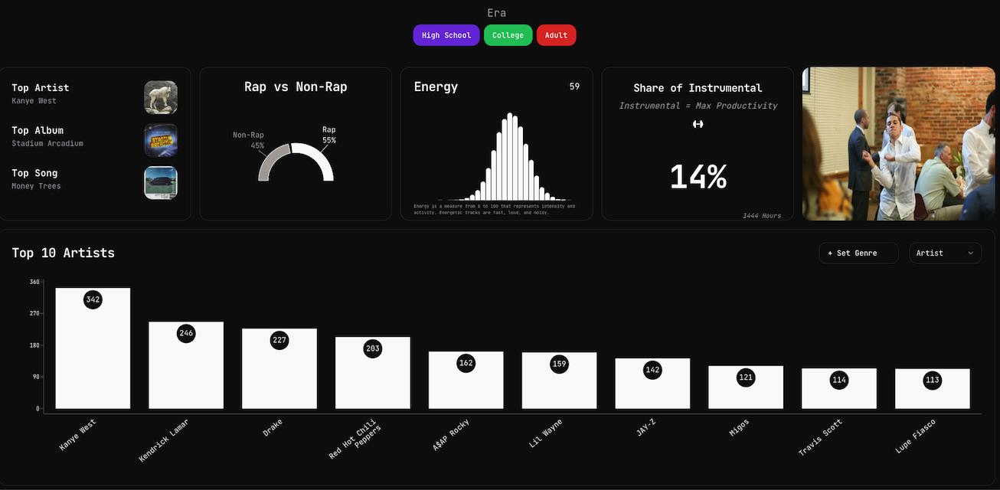

# Spotify ETL

> Extract Spotify History and Inject into DB for use in [my NextJS
> website](https://spotify-dashboard-sandy.vercel.app/)



::: {.cell 0=‘h’ 1=‘i’ 2=‘d’ 3=‘e’}

``` python
import os
import pandas as pd
import spotipy
from spotipy.oauth2 import SpotifyClientCredentials

from pathlib import Path
from sqlalchemy import create_engine
from dotenv import load_dotenv
from spotify_etl.core import extract_streaming_history

load_dotenv()
POSTGRES_URL = os.getenv("POSTGRES_URL")
engine = create_engine(POSTGRES_URL)
sp = spotipy.Spotify(auth_manager=SpotifyClientCredentials())
```

:::

::: {.cell 0=‘h’ 1=‘i’ 2=‘d’ 3=‘e’}

``` python
pd.read_sql("SELECT SUM(hours_played) from spotify_data_overview", engine).iloc[
    0, 0
].round(2) / 10 / 365
```

<div class="cell-output cell-output-display">

    2.893060273972603

</div>

:::

::: {.cell 0=‘h’ 1=‘i’ 2=‘d’ 3=‘e’}

``` python
streaming_history = extract_streaming_history(Path("streaming_history"))
```

:::

I love music.

Since 2014 I’ve listened to around `3 hours` of music a day on Spotify.
Hardly a day has gone by since I was 15 that I haven’t listened to any
music.

While sad I cried to music. While happy I danced to music. While angry I
raged to music.

My spotify history isn’t just some random dataset I scraped online. It’s
personal. Inside it are a thousand songs that tell my life story. I want
to find a way to tell that story.

Like many websites, Spotify [provides users with access to their
data](https://support.spotify.com/us/article/data-rights-and-privacy-settings/?ref=related).
While it’s amazing this dataset exists, it’s not entirely useful in
itself. See the dictionary below for a example record from 2017 <br>

    {'ts': '2017-04-22T21:43:11Z',
     'username': 1241589622,
     'platform': 'iOS 10.2 (iPhone7,2)',
     'ms_played': 183925,
     'conn_country': 'US',
     'ip_addr_decrypted': '174.227.14.87',
     'user_agent_decrypted': 'unknown',
     'master_metadata_track_name': 'Seen It All',
     'master_metadata_album_artist_name': 'Jeezy',
     'master_metadata_album_album_name': 'Seen It All: The Autobiography',
     'spotify_track_uri': 'spotify:track:0jkeRqlWciqKxU3iHQfdWj',
     'episode_name': None,
     'episode_show_name': None,
     'spotify_episode_uri': None,
     'reason_start': 'clickrow',
     'reason_end': 'fwdbtn',
     'shuffle': False,
     'skipped': nan,
     'offline': False,
     'offline_timestamp': 1492897206495,
     'incognito_mode': False}

Admittedly, there are some cool tidbits here.

1st off: I was listening to Jeezy at 10PM on a Saturday night, my senior
year of high school… I don’t imagine I was up to much good.

Additionally I can see what phone I had at that time (cool), the reason
I started, and ended, the track, and what album the song was from.

That’s all solid information but it has no depth. It doesn’t help me
tell my story.

It’s missing crucial metadata about the song like its energy, genre, and
release date. In order to find all this information another tool is
required: [the spotify
api](https://developer.spotify.com/documentation/web-api/reference/get-track).
The API has (most) of the information. See below <br>

``` python
track = sp.track("0jkeRqlWciqKxU3iHQfdWj")
{
    k: track[k]
    for k in ["artists", "duration_ms", "explicit", "name", "popularity", "preview_url"]
}
```

    {'artists': [{'external_urls': {'spotify': 'https://open.spotify.com/artist/4yBK75WVCQXej1p04GWqxH'},
       'href': 'https://api.spotify.com/v1/artists/4yBK75WVCQXej1p04GWqxH',
       'id': '4yBK75WVCQXej1p04GWqxH',
       'name': 'Jeezy',
       'type': 'artist',
       'uri': 'spotify:artist:4yBK75WVCQXej1p04GWqxH'},
      {'external_urls': {'spotify': 'https://open.spotify.com/artist/3nFkdlSjzX9mRTtwJOzDYB'},
       'href': 'https://api.spotify.com/v1/artists/3nFkdlSjzX9mRTtwJOzDYB',
       'id': '3nFkdlSjzX9mRTtwJOzDYB',
       'name': 'JAY-Z',
       'type': 'artist',
       'uri': 'spotify:artist:3nFkdlSjzX9mRTtwJOzDYB'}],
     'duration_ms': 207533,
     'explicit': True,
     'name': 'Seen It All',
     'popularity': 59,
     'preview_url': None}

With the track endpoint we start to get some more information! We see
that Jay-Z is also on the track, that it’s explicit (…), and how long
the song is.

We can do better.

Let’s take a look at the `Audio Feature` endpoint

``` python
sp.audio_features("0jkeRqlWciqKxU3iHQfdWj")
```

    [{'danceability': 0.711,
      'energy': 0.833,
      'key': 7,
      'loudness': -4.818,
      'mode': 1,
      'speechiness': 0.154,
      'acousticness': 0.135,
      'instrumentalness': 0,
      'liveness': 0.301,
      'valence': 0.545,
      'tempo': 106.094,
      'type': 'audio_features',
      'id': '0jkeRqlWciqKxU3iHQfdWj',
      'uri': 'spotify:track:0jkeRqlWciqKxU3iHQfdWj',
      'track_href': 'https://api.spotify.com/v1/tracks/0jkeRqlWciqKxU3iHQfdWj',
      'analysis_url': 'https://api.spotify.com/v1/audio-analysis/0jkeRqlWciqKxU3iHQfdWj',
      'duration_ms': 207533,
      'time_signature': 4}]

Now we’re cooking baby!

Now we can start to quantify the songs I’m listening to. Seen It All is
high energy (yeah it is), pretty danceable, and has a tempo of 106 BPM.

What about the genre though?

In my opinion that’s one of the most important characteristics of a song
and it turns out that spotify only provides genre metadata at the artist
level `:(`

``` python
sp.artist("4yBK75WVCQXej1p04GWqxH")
```

    {'external_urls': {'spotify': 'https://open.spotify.com/artist/4yBK75WVCQXej1p04GWqxH'},
     'followers': {'href': None, 'total': 2360020},
     'genres': ['atl hip hop',
      'crunk',
      'dirty south rap',
      'gangster rap',
      'old school atlanta hip hop',
      'rap',
      'southern hip hop',
      'trap'],
     'href': 'https://api.spotify.com/v1/artists/4yBK75WVCQXej1p04GWqxH',
     'id': '4yBK75WVCQXej1p04GWqxH',
     'images': [{'height': 640,
       'url': 'https://i.scdn.co/image/ab6761610000e5eb075a4c9d6da66addd8247c12',
       'width': 640},
      {'height': 320,
       'url': 'https://i.scdn.co/image/ab67616100005174075a4c9d6da66addd8247c12',
       'width': 320},
      {'height': 160,
       'url': 'https://i.scdn.co/image/ab6761610000f178075a4c9d6da66addd8247c12',
       'width': 160}],
     'name': 'Jeezy',
     'popularity': 70,
     'type': 'artist',
     'uri': 'spotify:artist:4yBK75WVCQXej1p04GWqxH'}

Throughout these notebooks I transform my original spotify data from a
bunch of json files to database tables and a materialized view that
enabled me to build a website.

And I’m only getting started…
